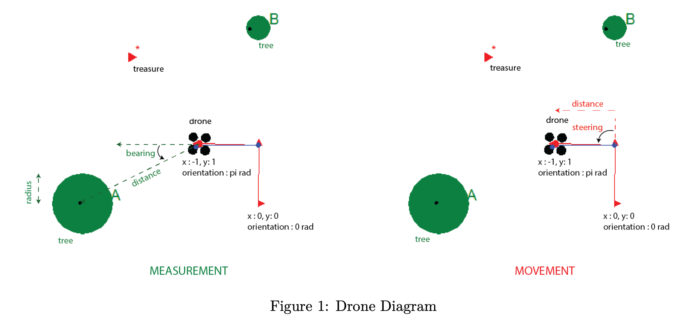

# CS 7638: AI for Robotics - Indiana Drones Project (SLAM)

## Project Description
Hello Indiana Drones! We uncovered the location of an invaluable piece of ancient treasure - the likes of which we have never seen before. Unfortunately, the treasure is located in a dense and dangerous jungle - making a typical safari impossible. That’s where you come in!

As a drone navigation and extraction expert, your mission should you choose to accept it, is to:

## Part A SLAM (worth 60 points): Estimate The Locations Of Trees In The Jungle Environment And The Drone Given Pre-Scripted Movements and Measurements
Complete the `SLAM` class in the `indiana_drones.py` file.

To test your SLAM module, `testing_suite_indiana_drones.py` initiates a drone at (0,0) in a jungle with a lot of trees for each test case. The location, size and number of the trees are initially unknown to you. The drone moves through the jungle environment in a series of pre-scripted movements. At each time step, the drone’s sensors report measurements that are passed through your `process_measurements` function and the makes movements that are passed through your `process_movement` function. The goal of these functions is to update your belief of the locations of the drone and trees in your environment given the measurement and movement inputs. Those estimates will be read using your `get_coordinates` function and compared against the ground truth.

The drone’s sensors report the distance (m), bearing (rad) and size (m) of trees (within the sensor’s horizon) relative to the drone’s location and orientation (See Figure 1 - Measurement). Note: since you only see trees within the sensor’s horizon, trees may appear and disappear in your measurements as you move through the environment and get closer/further to previously unseen/seen trees. The drone’s controller turns the drone by the pre-scripted steering angle (rad) followed by a movement in a straight line by the pre-scripted distance (m) (See Figure 1 - Movement). Both the measurement and movement have gaussian noise in their distance and bearing/steering.

In each test case, 30 points is for accurately estimating (within a 0.25 meter radius) the position of your drone and 30 points is for accurately estimating (within a 0.25 meter radius) the location of each of the trees. Points are deducted for each inaccuracy.

## Part B Navigation (worth 40 points): Navigate To The Treasure While Avoiding Trees In Your Path and Extract It
Complete the `IndianaDronesPlanner` class in the `indiana_drones.py` file

To test your SLAM module, the `testing_suite_indiana_drones.py` initiates a drone at (0,0) in a jungle with a lot of trees for each test case. The location, size and number of the trees are initially unknown to you. There is a piece of treasure in the environment whose location is known to you. The goal of your planner should be to move towards the treasure and extract it while avoiding crashes with trees on its way.

At each time step, the drone’s sensors report their measurements and this is provided as input to the `next_move` function along with the location of the drone. The output of the function is used to move the drone through the jungle environment/extract the treasure. The output of your navigation algorithm can be one of two actions in the `next_move` function: namely `move` and `extract`. The `move` action moves the drone by the steering angle and distance you prescribe. Your drone has a maximum turning angle [in radians] and a maximum distance [in meters] that it can move each timestep [both passed using a parameter]. Movement commands that exceed these values will be ignored and cause the drone to not move. The `extract` action extracts the treasure at your location. The treasure will only be extracted if it is within the defined radius (0.25 meters). If not there will be a time penalty for extracting dirt.

You should specify the movement as follows: `move 1 1.57.` [command distance steering] which means the drone will turn counterclock-wise 90 degrees [1.57 radians] first and then move a distance of 1 meter. When you issue your extract action you should supply 3 arguments total, including the treasure type `(*)` and current estimated location `(x, y)` of the drone as follows: `extract*1.5 - 2.1`[command treasure_type x y].

Whenever the drone enters within a particular radius of a tree’s center (i.e. the canopy of a tree), it is deemed to have crashed. In this project we assume the drone is a point (even though in the visualization it occupies some area). Note: The drone moves on a straight line path, so even if the starting and ending points of your movement aren’t inside the tree’s canopy, the path could still intersect the tree, which would result in a penalty. The `line_circle_intersect` function in `testing_suite_indiana_drones.py` may be helpful. 40 points is for extracting the treasure within the time limit, of which 10 points is deducted for each tree crash (upto a maximum of 20 points). For example, if the drone extracted the treasure within the time limit but crashed into one tree and one tree only, you will receive 30 points.

## Submitting your Assignment
We are using the Gradescope autograder system which allows you to upload and grade your assignment with a remote / online autograder. You must submit your `indiana_drones.py` file (only) to Gradescope to receive credit. Do not archive (zip,tar,etc) it. Your code must be valid python code, and you may use external modules.

We encourage you to keep any testing code in a separate file that you do not submit. Your code should also NOT display a GUI or Visualization when we import or call your function under test.

## Testing Your Code
We have provided a testing suite and test cases similar to the one we’ll be using for grading the project, which you can use to help ensure your code is working correctly. These testing suites are NOT complete, and you will need to develop other, more complicated, test cases to fully validate your code. We also recommend making your own simple/trivial test cases to unit test your algorithm as you code it. We encourage you to share your test cases (only) with other students on Ed Discussions.

The `testing_suite_indiana_drones.py` will run all cases from both part A and part B 10 times, remove the lowest score for each and average the rest to calculate your score. It will do this automatically (i.e. you do not need to loop your code). Since the score is stochastic and may have small variations, feel free to run your code on Gradescope multiple times.

Ensure that your code consistently succeeds on each of the given test cases as well as on a wide range of other test cases of your own design. For each test case, your code must complete execution within the prescribed time limit (10 seconds) or it will receive no credit. Note that the grading machine is relatively low powered, so you may want to set your local time limit to 5 seconds to ensure that you don’t go past the CPU limit. Note that if `VERBOSE` is on in the `testing_suite_indiana_drones.py` file, printing will take a lot of time and slow down your execution. So please feel free to increase the time limit while debugging with the `VERBOSE` on, but when you submit your code, it should run within the 10 second time limit on Gradescope.

Usage: `python testing_suite_indiana_drones.py`

## Visualization and Debugging
A visualization file has been provided to aid in debugging. The visualization will plot 6 pieces of data: the real location of drone, the estimated location of drone, the real location of trees, the estimated location of trees, the types of the trees (‘A’, ‘B’,... etc) and the location of treasure present in the environment. The real location of the drone will be a drone with 4 rotors. The estimated location of the drone will be a small blue dot. The real location of trees will be represented by circles of varying radii. The trees that are visible to the drone’s sensors are green in color and the trees that are too far away for the sensor to detect are in gray. The estimated location of a tree will be a small black dot. The type of tree/treasure will be next to the real location. The treasure is represented by a red triangle.

The estimated points to plot need to be returned from `next_move` as a 2nd (optional) value in the form of a dictionary. This is needed to show your SLAM system’s estimates of drone and landmark location in the visualization. The keys should be the landmark id and the values should be its x,y coordinates. The key representing the drone’s estimated location will be `‘self’`. `{'self': (.2, 1.5), landmark id 1: (.4,1.9)}`

Usage: `python visualize.py [-h] [--part {A,B}] [--case {1,2,3,4,5}]`

Example to run the visualization: `python visualize.py --part B --case 3`

The `visualize.py` and `testing_suite_indiana_drones.py` have a `VERBOSE_FLAG`. If the FLAG is True, it will print helpful outputs in the terminal for debugging. In addition, there is a `NOISE_FLAG` in the `testing_suite_indiana_drones.py`. Ensure that your code works with no noise first before you test against a noisy environment.

## Academic Integrity
You must write the code for this project alone. While you may make limited usage of outside resources, keep in mind that you must cite any such resources you use in your work (for example, you should use comments to denote a snippet of code obtained from StackOverflow, lecture videos, etc).

You must not use anybody else’s code for this project in your work. We will use code-similarity detection software to identify suspicious code, and we will refer any potential incidents to the Office of Student Integrity for investigation. Moreover, you must not post your work on a publicly accessible repository; this could also result in an Honor Code violation [if another student turns in your code]. (Consider using the GT provided Github repository or a repo such as Bitbucket that doesn’t default to public sharing.)

## Frequently Asked Questions (F.A.Q.)
Q: I’m confused. We are given so many files. What exactly should we do again and in which file?
A: The main file you are concerned with is `indiana_drones.py`. This is what you fill and submit to gradescope. It contains two classes (`SLAM` and `IndianaDronesPlanner`) whose methods are used by the `testing_suite_indiana_drone.py` to run SLAM and Navigation respectively in various test cases to generate your score. `drone.py` contains helper classes and methods that you are free to use in your implementation. `visualize.py` is provided to help you debug your code with a visualization.

Q: Where does the drone start? Which way is it facing?
A: Although the drone starts in different places in different test cases, you can assume that it starts at (0,0) for each test case and report your outputs accordingly. Your drone will always have a bearing of zero degrees when it starts (i.e. facing east).

Q:What are the `(x, y)` return values from `get_coordinates` function relative to?
A: They should return your best guess for the position of the drone and trees relative to the drone’s starting location (0,0).

Q: How can I uniquely identify trees in the environment?
A: Each tree will have a unique landmark id. Although there may be more than one of the same type of tree in the area, each will have a unique id.

## Things To Think About
1. GraphSLAM estimates the X and Y locations of the drone, but the orientation accumulates noise too. Do you need to handle that? If you do, think about how you would do so.
2. GraphSLAM assumes that the noise is in the X and Y directions and are independent. However, the measurements and movements have noise in their distance and bearing/steering angle. Does this cause an issue? If so, how would you handle that? Are simple heuristics enough or do you need a detailed model?
3. How can the drone detect a potential crash of its path with a tree? And when it detects a potential crash with a tree, how can the drone avoid the crash? Could it figure out what options it has and choose one way it could go? Or does it need to find an exact path to avoid the crash?
