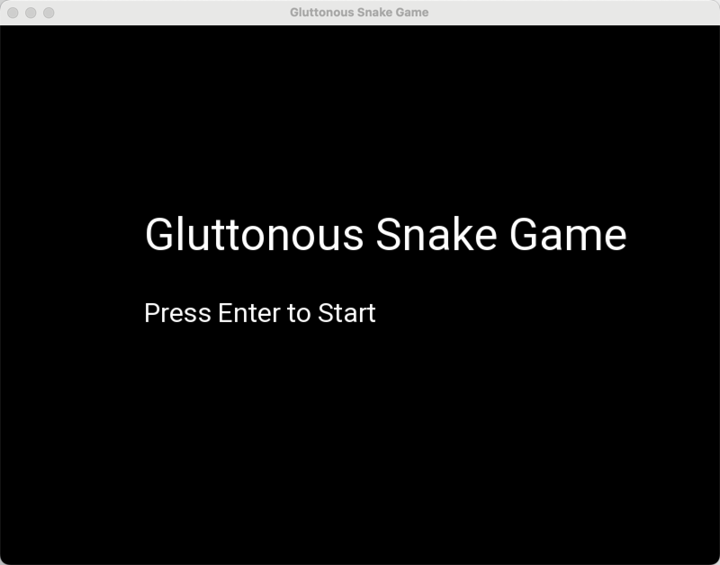
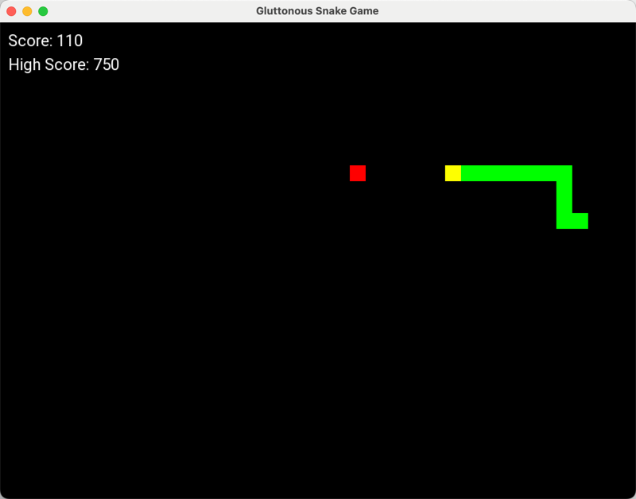
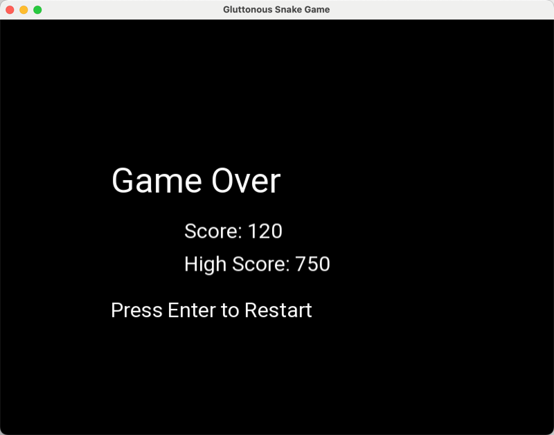

# 任务描述
## 交付要求
### DDL
- 12.16

### 基本要求
无

### 作业要求
使用 C++ 完成一个贪吃蛇游戏的开发。
要求基于 SFML 库以及 Vscode

（可/考虑）实现的内容：
- [x] 使用指针管理动态对象（如：蛇，食物...），还有面向对象编程，使用继承和多态
- [x] 提升用户体验：平滑的动画，音效，背景音乐
- [ ] 双人同时游戏

基本要求：
- [x] 贪吃蛇游戏运行

高阶要求：
- [x] Game Over 界面
- [x] 难度变化：随时间/得分，速度加快
- [x] 音效：吃食物音效、碰撞音效，背景音效
- [ ] 动画：考虑吃食物或身体长大动画
- [x] 最高分模块

### 任务输出
- [x] 代码及依赖文件 
  - 游戏主文件: gluttonous_snake.cpp
  - 字体文件: Roboto-Regular.ttf
  - 分数文件: highscore.dat
  - 音效文件: background.wav, collision.wav, eating.wav
- [x] 代码说明
  - README.md

### 其他注意事项
无

## 任务完成情况
1. 游戏开始界面
- 按 Enter 键开始游戏

2. 游戏运行界面
- 使用 上下左右 控制蛇的移动
- 黄色代表蛇头，控制方向，绿色代表蛇的身体
- 红色代表食物，吃一次食物 + 10 分
- 每 100 分难度会升级
- 界面左上角显示当前分数及历史最高分数
- 游戏界面窗口四周是墙，碰撞会结束游戏
- 触碰蛇的身体也会导致游戏结束
- 游戏过程有三种音效：背景音乐、吃食物音效、碰撞音效

3. 游戏结束界面
- 显示分数，按 Enter 键重新开始游戏
