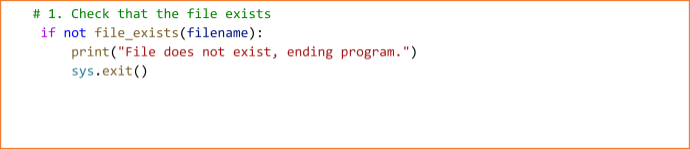
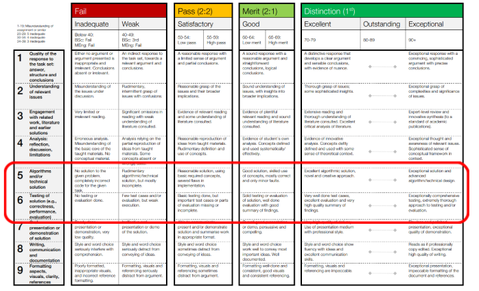

# Vampire Hunting

## COMP0015 2024-2025 Term 1 Coursework – 60% of the module

This document explains the arrangements for the coursework. You will create an application that analyses a dataset to determine how a vampire infiltration spreads based on testing and contact tracing data. This document is fairly lengthy; do not be deterred by this. The coursework has been carefully designed so that you can complete it part by part and know that you have the correct functionality at each point. Each part is described in its own section.

**Strong suggestion**: start your coursework as early as possible to give yourself time to resolve issues you encounter. 

## How to submit your work

Submit your contact.py file at the assignment link on Moodle. Do not submit any other files. Do not upload a folder containing your files because this can cause compatibility issues for the marking team. You must ensure that your program works properly on your own computer before you submit the code.

**Important**: make sure your student number (not your name) is included in the comments at the top of your program.

Testing

*You are responsible for testing your program carefully*. Make sure that you have thought about all the things that can go wrong and test your program to ensure that you know it works correctly in all circumstances.

However, as an aid, we have developed a web-based testing service. *We strongly encourage you to take advantage of this service*. More details can be found in Appendix 1, the following points are key:

1. The tool may be extremely helpful—in previous terms, students in aggregate used the service 5,000+ times.
1. Nevertheless, the tool does not provide any guarantee of a final grade.
   1. Your final submission will be tested on additional datasets, which can change scores.
   1. Your final grade will include marks for comments/style, which can change scores.
   1. We reserve the right to modify your grade after manual inspection. For example, attempts to “trick” the autograder will result in zero marks.
   1. If your code does not work with the autograder, we may attempt to modify it to award a non-zero grade. If successful, we will deduct some marks (typically 10-20%, although we make no guarantees). Accordingly, please make sure your code works properly with the autograder before submitting.
1. We do not guarantee that the testing service will always be available (*e.g.*, the server may crash).
1. The testing service tests each part individually. If you get stuck on one section but can get something working for a later section, then you may still be able to get marks for that later section, even if running it on your own machine (which will use the pre-defined main() function from the template) doesn’t work.
1. The testing service can sometimes get confused by non-ASCII characters. Accordingly, and with apologies, avoid using Amharic/Arabic/Chinese/Thai/etc. characters in your code, even within comments.

1 VERSION 1.4.4 AS OF NOVEMBER 18, 2024

## Assessment

You are expected to show that you can code competently using the programming concepts covered in the course including (but not limited to): the use of files, strings, lists, dictionaries, sets, conditions, loops, and functions.

Marking criteria will include:

- Correctness – your code must perform as specified.
- You must apply Python concepts appropriately.
- Programming style – see section ‘Appendix 2 Style Guide’ for more detail.
- Your assignment will be marked using the rubric in Appendix 3. This is the standard rubric used in the Department of Computer Science. Marks for your project work will be awarded for the capabilities (i.e. functional requirements) your system achieves, and the quality of the code. Categories 5 and 6 of the rubric will be used for coding assignments.

Before starting your assignment

You are provided with some starter code in the file template.py. Your first action should be to make a copy of this code into a new file, contact.py, where you will work afterwards. You have also been given a helper file format\_list.py; you shouldn’t modify this but will need to have it in the same directory. You have also been given some text input files containing infiltration data (DataSet0.txt … DataSet5.txt) and associated text output files (DataSet0-out.txt … DataSet5-out.txt). You should put these in the same directory also.

**Before you start writing code, read through this entire document so that you have a sense of what’s coming and can start to think about how different parts are going to work together.** The overall task is more complex than anything you’ve done so far, but it’s also been broken into—forgive me—bite-sized pieces. In section 22, there is a summary of all of the different functions you have to write, the number of lines in the official solution (just to give yourself a sense of relatively difficulty—your own solution might be quite a bit longer, and that’s ok), and an informal sense of which parts are a bit trickier than others (sometimes short functions can be trickier than long ones).

Keep in mind that the testing service you have access to (see appendix 1) and the way we will do the grading will be function-by-function. So, even if you can’t get some critical function working correctly, work on other functions.

Good luck and enjoy!

Running the contact tracing program

There are two ways to run the program from the terminal depending on whether you want to provide the data file name on the command line or whether you want the user to be prompted for the file name. The code in main() contains code to handle this. Important: you should not edit the code in main().

Entering a file name on the command line (suggested)

On Windows, run the program in the terminal, specifying the data file name:

3 VERSION 1.4.4 AS OF NOVEMBER 18, 2024

||||
| :- | :- | :- |
or on macOS type:

The meaning of the terms on this line is:

|python or python3|The python interpreter. On macos this will be python3 and on Windows, this will be py or python.|
| - | :- |
|contact.py|The name of the python program.|
|DataSet0.txt|Name of the data file.|

*Table 1 Running the program, specifying the file name on the command line* Prompting the user for a file name (possible, but perhaps a bit painful to test)

To prompt the user for a file name, simply run the program in your editor (IDE) as you would normally.

Section 1: Orientation

You have been given several files containing testing and contact tracing data for vampire infiltrations. This data has a “*preamble”* (initial part), followed by a list of testing and contact tracing data for a series of days (“*body*”). The format will be explained in detail below.

In order to work with the contact tracing data, you will need to load a data file storing contact tracing data and create appropriate data structures such as a dictionary or a list. These data structures can be used to identify the relationship between the individuals in the data.

Many of the sections require you to print out data after you have calculated it, often in separately-specified functions. Sometimes functions will require you to check for some kinds of data errors, print specified error messages, and then exit by calling sys.exit().

Important: do not modify the main() function; all of your work should be in the other functions as specified in the various sections. Do not add code that just runs at the “top level”. All of your code should be inside functions.

Important: Part of our testing procedure is to run functions individually. Make sure that your function names, parameters, and return values don’t change from our specification. Moreover, make sure that your functions do what they are supposed to do, rather than *e.g.*, trying to do one big function that does the job of several of our specified functions.

Important: Ensure that your program’s output matches **exactly** the output given to you unless otherwise specified.

Important: do not import any additional packages; lines 7-9 of the template.py file already imports sys, os.path, and format\_list; that’s all you need (and all you are allowed).

Data files

The files (as well as your assignment’s expected output for each file) are posted on moodle with the assignment information. Each file ends with the .txt extension. You can open the files in Visual Studio Code or in a text editor to see the contents.

4 VERSION 1.4.4 AS OF NOVEMBER 18, 2024

||||
| :- | :- | :- |
Preamble

The preamble begins with a (comma-separated) list of individuals (without specifying which are humans and which are vampires). These are all of the individuals that may appear in the rest of the dataset. On the next line, the preamble gives the number of days of data that will follow. For example, a valid preamble would be as follows:

Bella, Edward, Jacob, Carlisle, Alice, Emmett, Charlie, Renee, Jessica, Angela

4

*N.B.* Sometimes spaces are included around names to aid human readability as in the above example; these are optional, but your code will have to remove them if they appear. The strip() method can help you do this.

Important: names may include a mixture of upper and lowercase letters, as well as some special characters such as dashes. Names will not include numbers, commas, colons, the newline character (“\n”), tabs (“\t”), or the symbol #. Spaces may appear within a name, *e.g.* “Kuan Yew”, but not at its beginning or end, *e.g.* no “ Kuan Yew ”.

Day

Unlike in some of the legends, our vampires are able to move around during the day, rather than sleeping in coffins. (Some of them do sleep in coffins at night, but that’s not important for this exercise.) We divide each of our days into two parts (AM, when testing occurs; and PM, when contact occurs). Each day has the following format. On the first line is a comma-separated list of people who have been given a vampirism test in the morning (AM) of that day (perhaps a brief exposure to sunlight); the result of the test (“V” for vampire or “H” for human) is given after each name, separated by a colon. If no one is given a test on a given day, this line will be the special string ##.

On the second line is a number of groups of people who had interactions in the afternoon (PM) of that day. On the third and following lines are comma-separated lists of individuals who have been in contact. To keep things simple:

1. Each individual can be in at most one contact group on a given day.
1. On the other hand, there’s no need for an individual to meet with anyone on a given day; in that case, their name won’t appear in any contact list for that day. When vampires are in the neighbourhood, staying home alone can be the safest option!
1. All people in a group meet simultaneously (perhaps to play a game of baseball).

Here’s an example of a valid day:

Edward : V, Bella : H, Jacob : H, Jessica : H 3

Bella, Edward

Charlie, Jacob

Alice, Renee

*N.B.* Again, spaces can appear to aid human readability; in this case you’ll have to remove them.

To complete the demonstration of the input, here are the remaining three days promised in the preamble above:

5 VERSION 1.4.4 AS OF NOVEMBER 18, 2024

||||
| :- | :- | :- |
Bella : H, Jacob:H, Alice :V, Charlie: H 2

Bella, Edward, Charlie

Angela, Jessica

Emmett : V, Renee : H, Jessica : V

0

Bella : V, Charlie: H

2

Bella, Edward, Charlie, Jessica, Angela Jacob, Renee

Notice that on the third day everyone stayed home (0 contract groups). None of the days had zero tests (which we would have indicated with ##).

**Note**: the above file is in fact one of the input testing files we give (DataSet1.txt).

Section 2: Check the file exists (1 mark)

Take a look at the following code in main():

The python code sys.exit() will cause the program to terminate if the file cannot be opened and read. Important: do not change the code in main().

The function file\_exists() takes the file name given as a parameter, and checks that the file exists. Your first task is to complete the function file\_exists(). The function file\_exists()must return True if the file exists and False if it does not. Hint: use the function isfile() from the python library[ os.path](https://docs.python.org/3/library/os.path.html).

Section 3: Create a structure to hold the input data (6 marks for correctly storing the data + 1 mark for correctly printing the error message when needed)

Complete the function parse\_file(). This function takes a file name as a parameter, reads the file line by line and creates a data structure to represent the input. The structure has the following format: at the “top” it is a *pair*. The first element of the pair is a *list* of names (the participants) in the order given in the file. The second element of the pair is a *list of pairs*; each list cell will correspond to a given day.

Within each list-pair, the first element should be a *dictionary* whose keys are the names of those tested for vampirism and whose values are the Booleans True (that is, a vampire, indicated by “V” in the input file) or False (that is, a human). The second element of a list-pair is a *list of lists*, with each “outer” list-element being an “inner” *list* of those groups who were in contact on that day. After you finish processing the file, make sure to close it, and then return the structure you’ve created. Here’s the structure we’d expect for the sample file given above, as printed by Python:

6 VERSION 1.4.4 AS OF NOVEMBER 18, 2024

||||
| :- | :- | :- |
(['Bella', 'Edward', 'Jacob', 'Carlisle', 'Alice', 'Emmett', 'Charlie', 'Renee', 'Jessica', 'Angela'], [({'Edward': True, 'Bella': False, 'Jacob': False, 'Jessica': False}, [['Bella', 'Edward'], ['Charlie', 'Jacob'], ['Alice', 'Renee']]), ({'Bella': False, 'Jacob': False, 'Alice': True, 'Charlie': False}, [['Bella', 'Edward', 'Charlie'], ['Angela', 'Jessica']]), ({'Emmett': True, 'Renee': False, 'Jessica': True}, []), ({'Bella': True, 'Charlie': False}, [['Bella', 'Edward', 'Charlie', 'Jessica', 'Angela'], ['Jacob',

'Renee']])])

If the file isn’t somehow formatted correctly – for example, if one of the numbers isn’t a number when you convert it to an integer – then print the error message

Error found in file, aborting. Then, exit (using sys.exit()).

Important: for this section, and all sections that follow, you should print to the screen (rather than, *e.g.*, writing your results to a file). Also, it is critical that you produce the **exact** error message we specify to get the mark.

Section 4: Pretty-print the data structure (4 marks)

Please fill in the function body of the function pretty\_print\_infiltration\_data(data). By “pretty,” what we mean is in a more human-readable format than the Python default shown above. Specifically, we’re expecting something in the following exact format (the reason one line is in red is explained below):

Vampire Infiltration Data

4 days with the following participants: Alice, Angela, Bella, Carlisle, Charlie, Edward, Emmett, Jacob, Jessica and Renee.

Day 1 has 4 vampire tests and 3 contact groups.

4 tests

Bella is human.

Edward is a vampire!

Jacob is human.

Jessica is human.

3 groups

Bella and Edward

Charlie and Jacob

Alice and Renee

Day 2 has 4 vampire tests and 2 contact groups.

4 tests

Alice is a vampire!

Bella is human.

Charlie is human.

Jacob is human.

2 groups

Bella, Charlie and Edward

7 VERSION 1.4.4 AS OF NOVEMBER 18, 2024

||||
| :- | :- | :- |
Angela and Jessica

Day 3 has 3 vampire tests and 0 contact groups.

3 tests

Emmett is a vampire!

Jessica is a vampire!

Renee is human.

0 groups

Day 4 has 2 vampire tests and 2 contact groups.

2 tests

Bella is a vampire!

Charlie is human.

2 groups

Angela, Bella, Charlie, Edward and Jessica Jacob and Renee

End of Days

There are a lot of parts here, so let’s take them one at a time.

As you can see, the printout begins with “Vampire Infiltration Data” and ends with “End of Days”. The next line, in red, is actually a single line, but to avoid small fonts in this writeup, it appears to be broken over two lines. (You shouldn’t try to change the printing colour in your solution; it’s just here for clarity on this issue.) All of the other lines for this dataset are short and thus do not have this issue.

There are many lists of participants, separated by commas and with a final “and”. You have been provided with module format\_list.py which contains the function format\_list(data). Use the function format\_list(data) to format a list as a string in this way.

The second line (in red) in the printout gives the information that was in the preamble of the input file. Afterwards, we have a series of days, which begin with the day number, the number of vampire tests, and the number of contact groups. Notice that when there is only 1 test or group, there is no “s” after “test” or “group.” In general, we make sure to get all of the plurals correct, in the printout. Hint: you should too.

Within a day, we start by repeating the number of tests. The line is indented to the right by two spaces. Then we give the results of each test, with the participants grouped in alphabetical order. Participant results are indented by four spaces. Then we repeat the number of groups (two space indent), and then a list of each of the groups (four space indent).

Hints: There are a number of other things to be careful of, like periods at the end of sentences (but not at the end of lists), and so forth. It’ll take some careful work to make sure you have the format exactly right.

Other than within a list of test results, participants should appear in the same order as the test file. (The test results were stored in a dictionary, which does not guarantee that order will be preserved. Rather than require that you somehow restore the original order, we simply require that you alphabetize the participants. Reminder: if you have a list mylst, then mylst.sort() will sort it; there are other ways to sort it too.)

Important: check the format of the output expected for the files given to you; unless we specify otherwise we expect you to follow this format exactly. The output expected for each data file can be found in the corresponding file name with the word “out” in the name. For example: the output for DataSet1.txt is given in DataSet1-out.txt.

8 VERSION 1.4.4 AS OF NOVEMBER 18, 2024

||||
| :- | :- | :- |
Section 5: Write lookup helper function (1 mark for correctness)

To analyse the infiltration carefully, we are going to need a notion of *time*. Recall that days are divided into two periods: AM, when testing occurs; and PM, when contact occurs. We also have a special “initial” period, before the scenario begins. This can be a bit unwieldy, so it’s better to have a more uniform treatment. Therefore, we represent units of time with integer values as follows:

1. When time = 0, we are in the initial period, also known as day 0.
1. When time = 1, we are just after the AM tests on day 1.
1. When time = 2, we are just after the PM contacts on day 1.
1. When time = 3, we are just after the AM tests on day 2.
1. When time = 4, we are just after the PM contacts on day 2.
1. And so forth…

Accordingly, given *d* days, we will have 1 + 2*d* time units.

We’ve provided some useful functions to navigate this in the format\_list.py file:

1. time\_of\_day(d,b) to convert a day (integer) and AM/PM time (Boolean, with True for AM and False for PM) into one of these time codes (AM/PM doesn’t matter for day 0).
1. day\_of\_time(t) to convert a time unit into a day.
1. period\_of\_time(t) to convert a time unit into an AM/PM (will return AM for day 0)
1. is\_initial(t) to check whether t is the initial period (*i.e.*, 0)
1. str\_time(t) to convert a time period to a string for printing, *e.g.* “3 (AM)” (*i.e.*, day 3 in the morning). When t = 0 this returns just “0” (since day 0 does not have an AM or PM).

Your task is to write the helpful to have a lookup function contacts\_by\_time(participant, time, contacts\_daily). The first parameter is the name of a participant, *e.g.* “Bella”. The second parameter is a time unit, *e.g.* 4 (which represents day 2 PM). The third parameter is a list of the contact groups on each day. Notice that the third parameter is indexed by *day*, with day 1 in index spot 0; accordingly, part of your task is to convert the time unit parameter to the day, and then adjust to the list index. The other part of your task is to search within the contact groups for that day to find the correct list for the given participant. If the participant didn’t meet with anyone on that day, then their contact list is empty. As a special case, contacts for day 0 should also be considered the empty list for every participant. Once you have the correct list, return it.

To help you test your function, there is some code in main() that examines the initial participant on an early day, in both the AM and PM (which should return the same list). In the specific dataset we’ve used so far, main() will print

Bella's contacts for time unit 3 (day 2) are Bella, Charlie and Edward. Bella's contacts for time unit 4 (day 2) are Bella, Charlie and Edward.

Section 6: Create the initial vampire knowledge data structure and a way to pretty print it (1 mark for correctness + 2 marks for pretty-printing)

Our goal will be to identify vampires and humans using logical deduction from data. We have no interest in guesswork and thus no interest in concluding that someone is *probably* a vampire (or human); we want *certainty*.

9 VERSION 1.4.4 AS OF NOVEMBER 18, 2024
||||
| :- | :- | :- |
Certainty is hard to come by, but hard does not mean impossible. Over the remainder of this assignment, we will explain some basic logical principles that justify various deductive steps. Our goal in this section is to set up the core *vampire knowledge data structure* (“vk structure”) we will need to track the information we’ve learned.

**Logical principle 1**: *at a given point in time t, reality is binary*. That is, every individual is either a human or a vampire at time *t*: no one can be both a human and a vampire *at the same time*. On the other hand, humanness is essentially a state of grace, and thus easy to lose over time (*e.g.*, a human at time *t* can be a vampire at time *t* + 1).

However, at a given point in time *t*, our *knowledge about reality is ternary*. At time *t*, every individual has one of *three* statuses: definitely human (“H”), definitely vampire (“V”), or unclear (“U”). Here, *definitely* means with certainty: there’s no chance that a definite human is “really” a vampire, or vice versa. This means that *at a specific moment in time t*, once H or V status is established for an individual, it should never change for that time *t* for that individual. Unclear status doesn’t mean the individual is both a human and a vampire (that’s impossible!); it just means that we aren’t sure. On the other hand, as we make deductive steps, U status might change (to “V” or “H”).

To represent knowledge at time *t*, we use a dictionary where the keys are the participants’ names and the values are one of three strings “H”, “V”, or “U”. Complete the function create\_initial\_vk(participants), where participants is the list of participants, and which returns such a dictionary structure. Initially we have no data about who is human and who is a vampire, so everyone’s initial status should be unclear (“U”).

The main() function will create 1 + 2*d* copies (where *d* is the number of days) of the initial vk structure to represent the vampire knowledge at each point in time. Initially, as you’ve created it, everyone’s status is unknown at all times.

Complete the function pretty\_print\_vampire\_knowledge(vk) to print the results of a vk structure. Here is an example of what the output should look like on the initial vk structure:

Humans: (None)

Unclear individuals: Alice, Angela, Bella, Carlisle, Charlie, Edward, Emmett, Jacob, Jessica and Renee

Vampires: (None)

Each row should be indented by two spaces. Again, text in red should be understood to be on a single line. Notice that format\_list(data) helpfully returns the string “(None)” when the given list is empty. Also notice that individuals are alphabetized within the various lists.

If you do this correctly, main() will use the function pretty\_print\_vks(), which in turn calls your pretty\_print\_section\_6(), to print out the initial vk structures for each point in time specified in the data.

Section 7: Create a function that updates a vk structure using the results of the tests (1 mark for correctness + 2 marks for error reporting)

**Logical principle 2**: *the vampirism tests given each day are conclusive*: there’s no chance of a human being mistaken for a vampire, or vice versa. On the other hand, other than by tests, there’s no direct way to tell who is a vampire and who is a human. (There are, however, indirect ways via logical deduction, as will be covered below.)

||||
| :- | :- | :- |
Complete the function update\_vk\_with\_tests(vk, tests). The first input to the function is a vk structure of the kind you just created in section 6, that is, a dictionary mapping participants to “H”/“V”/“U”. The second input is a subpart of the structure you created in section 3: specifically, it is a dictionary matching participant names with the Boolean results of the tests on a given day: True for vampirism and False for humanism.

The rules for update are as follows. If an individual has unknown “U” status, then we update their status with “V” or “H” depending on the result of the test. If a definite human (“H”) tests positive for vampirism, we’ve discovered an error in the data and should output:

Error found in data: humans cannot be vampires; aborting.

On the other hand, if a definite vampire (“V”) tests negative for vampirism, we’ve discovered another kind of error in the data and should output:

Error found in data: vampires cannot be humans; aborting.

Of course, if a human tests positive for humanness, then they remain human; likewise, if a vampire tests positive for vampireness then they remain a vampire.

There’s one other possible error we need to check for: if we find that someone has a test, who is not a participant, we should output:

Error found in data: test subject is not a participant; aborting.

In all cases when we find an error we should then exit (with sys.exit()) after printing the error message. Lastly, anyone who hasn’t taken a test that day should keep the same H/V/U status that they already have. Important: Assuming we don’t find an error, you should return the updated dictionary structure.

The main() function will print out the updated vk structure table accordingly. In the case of our example:

Vampire Knowledge Tables

Day 0:

Humans: (None)

Unclear individuals: Alice, Angela, Bella, Carlisle, Charlie, Edward, Emmett, Jacob, Jessica and Renee

Vampires: (None)

Day 1 (AM):

Humans: Bella, Jacob and Jessica

Unclear individuals: Alice, Angela, Carlisle, Charlie, Emmett and Renee Vampire: Edward

Day 1 (PM):

Humans: (None)

||||
| :- | :- | :- |
Unclear individuals: Alice, Angela, Bella, Carlisle, Charlie, Edward, Emmett, Jacob, Jessica and Renee

Vampires: (None)

Day 2 (AM):

Humans: Bella, Charlie and Jacob

Unclear individuals: Angela, Carlisle, Edward, Emmett, Jessica and Renee Vampire: Alice

Day 2 (PM):

Humans: (None)

Unclear individuals: Alice, Angela, Bella, Carlisle, Charlie, Edward, Emmett, Jacob, Jessica and Renee

Vampires: (None)

Day 3 (AM):

Human: Renee

Unclear individuals: Alice, Angela, Bella, Carlisle, Charlie, Edward and Jacob

Vampires: Emmett and Jessica

Day 3 (PM):

Humans: (None)

Unclear individuals: Alice, Angela, Bella, Carlisle, Charlie, Edward, Emmett, Jacob, Jessica and Renee

Vampires: (None)

Day 4 (AM):

Human: Charlie

Unclear individuals: Alice, Angela, Carlisle, Edward, Emmett, Jacob, Jessica and Renee

Vampire: Bella

Day 4 (PM):

Humans: (None)

Unclear individuals: Alice, Angela, Bella, Carlisle, Charlie, Edward, Emmett, Jacob, Jessica and Renee

Vampires: (None)

End Vampire Knowledge Tables

Again, lines in red should be understood to be on one line rather than two.

You may notice a few things if you look at the data. First, on each day, the results of the tests are now reflected in the AM portion. Thus, Bella and Jacob are human at noon on day 1, whereas Edward is a vampire. Second, the PM portions of the vk structures haven’t been changed at all, since tests are only given in the AM. Third, we do not “carry” the results of any tests to any other days; each day at this point of the analysis is fresh/independent.

Section 8: Create a function that updates a vk structures by pushing vampire status forwards in time (2 marks for correctness + 1 mark for error reporting)

**Logical principle 3a**: *vampirism has no cure*. Accordingly, once an individual is confirmed to be a vampire at a given time, they are certain to be a vampire ever afterwards.

||||
| :- | :- | :- |
Complete the function update\_vk\_with\_vampires\_forward(vk\_pre, vk\_post). Both inputs to the functions are vk structures, but the second must occur after the first. Your goal is to take the vampire knowledge in the former and propagate it to the latter. However, knowledge is precious: don’t accidentally erase definite knowledge in the post as you go!

In particular, if participant *p* is a vampire before, then *p* must also be a vampire after. If this was already known in the later period (perhaps a vampire was tested twice!), then *p*’s vampiric status is unchanged. If *p*’s status was unknown in the later period, update it to vampire. On the other hand, if *p*’s status was definitely human, then you’ve discovered an error in the data and should print out

Error found in data: vampires cannot be humans; aborting.

and then exit with sys.exit(). If *p*’s status is not a vampire in the earlier vk structure, then you shouldn’t change anything in the later vk structure. We’re only concerned with pushing vampire status forward in time for now.

Once you’ve calculated the updated post vk structure, return it. Main will then print out an updated structure, which should look like this for our test dataset:

Vampire Knowledge Tables

Day 0:

Humans: (None)

Unclear individuals: Alice, Angela, Bella, Carlisle, Charlie, Edward, Emmett, Jacob, Jessica and Renee

Vampires: (None)

Day 1 (AM):

Humans: Bella, Jacob and Jessica

Unclear individuals: Alice, Angela, Carlisle, Charlie, Emmett and Renee Vampire: Edward

Day 1 (PM):

Humans: (None)

Unclear individuals: Alice, Angela, Bella, Carlisle, Charlie, Emmett, Jacob, Jessica and Renee

Vampire: Edward

Day 2 (AM):

Humans: Bella, Charlie and Jacob

Unclear individuals: Angela, Carlisle, Emmett, Jessica and Renee Vampires: Alice and Edward

Day 2 (PM):

Humans: (None)

Unclear individuals: Angela, Bella, Carlisle, Charlie, Emmett, Jacob, Jessica and Renee

Vampires: Alice and Edward

Day 3 (AM):

Human: Renee

Unclear individuals: Angela, Bella, Carlisle, Charlie and Jacob

||||
| :- | :- | :- |
Vampires: Alice, Edward, Emmett and Jessica

Day 3 (PM):

Humans: (None)

Unclear individuals: Angela, Bella, Carlisle, Charlie, Jacob and Renee Vampires: Alice, Edward, Emmett and Jessica

Day 4 (AM):

Human: Charlie

Unclear individuals: Angela, Carlisle, Jacob and Renee

Vampires: Alice, Bella, Edward, Emmett and Jessica

Day 4 (PM):

Humans: (None)

Unclear individuals: Angela, Carlisle, Charlie, Jacob and Renee Vampires: Alice, Bella, Edward, Emmett and Jessica

End Vampire Knowledge Tables

It’s clear that vampirism is monotone increasing over time, and indeed it seems to be rather infectious: by the end of the fourth day, *at least* half of the town is a vampire! On the other hand, we still don’t know much about the humans involved, except those that test as such, and even then only on the morning of their test.

Section 9: Create a function that updates a vk structures by pushing human status backwards in time (2 marks for correctness + 1 mark for error reporting)

**Logical principle 3b**: *vampirism has no cure*. A bit less obviously than in section 7, we can reuse this idea to deduce that if an individual is confirmed to be a human at a given time, they are certain to have been a human up until that point. In other words, while vampirism propagates forwards in time, humanness propagates backwards.

Complete the function update\_vk\_with\_humans\_backward(vk\_pre, vk\_post). Both inputs to the functions are vk structures, but (as before) the second must occur after the first. Your goal is to take the human knowledge in the latter and propagate it to the former – that is, information is in a sense flowing backwards in time. Once again, knowledge is precious: don’t accidentally erase definite knowledge in the pre as you go!

In particular, if participant *p* is a human after, then *p* must also be a human before. If this was already known in the earlier period, then *p*’s human status is unchanged. If *p*’s status was unknown in the earlier period, update it to human. On the other hand, if *p*’s status was definitely vampire, then you’ve discovered an error in the data and should print out

Error found in data: humans cannot be vampires; aborting.

and then exit with sys.exit(). If *p*’s status is not a human in the later vk structure, then you shouldn’t change anything in the earlier vk structure. We’re only concerned with pushing human status backward in time for now. Once you’ve calculated the updated pre vk structure, return it. main() will print out an updated structure, *e.g.*:

Vampire Knowledge Tables

Day 0:

Humans: Bella, Charlie, Jacob, Jessica and Renee

Unclear individuals: Alice, Angela, Carlisle, Edward and Emmett

||||
| :- | :- | :- |
Vampires: (None)

Day 1 (AM):

Humans: Bella, Charlie, Jacob, Jessica and Renee

Unclear individuals: Alice, Angela, Carlisle and Emmett

Vampire: Edward

Day 1 (PM):

Humans: Bella, Charlie, Jacob and Renee

Unclear individuals: Alice, Angela, Carlisle, Emmett and Jessica Vampire: Edward

Day 2 (AM):

Humans: Bella, Charlie, Jacob and Renee

Unclear individuals: Angela, Carlisle, Emmett and Jessica

Vampires: Alice and Edward

Day 2 (PM):

Humans: Charlie and Renee

Unclear individuals: Angela, Bella, Carlisle, Emmett, Jacob and Jessica Vampires: Alice and Edward

Day 3 (AM):

Humans: Charlie and Renee

Unclear individuals: Angela, Bella, Carlisle and Jacob

Vampires: Alice, Edward, Emmett and Jessica

Day 3 (PM):

Human: Charlie

Unclear individuals: Angela, Bella, Carlisle, Jacob and Renee Vampires: Alice, Edward, Emmett and Jessica

Day 4 (AM):

Human: Charlie

Unclear individuals: Angela, Carlisle, Jacob and Renee

Vampires: Alice, Bella, Edward, Emmett and Jessica

Day 4 (PM):

Humans: (None)

Unclear individuals: Angela, Carlisle, Charlie, Jacob and Renee Vampires: Alice, Bella, Edward, Emmett and Jessica

End Vampire Knowledge Tables

Humanism is monotone decreasing over time. We’re beginning to make real progress: we know that at least half the town was human before the vampires arrived. We can also see that at least two humans (Bella and Jessica) became vampires during the four days. In the next two sections we will consider how that might have happened.

Section 10: Create a function that updates a vk structures by propagating human/vampire status forward overnight (1 mark for correctness + 1 mark for error reporting)

**Logical principle 4**: *everyone is safe at night*. Unlike in the most traditional legends, our vampires don’t hunt at night. This means that anyone who is still human at the end of a day is also human at the beginning of the next day.

||||
| :- | :- | :- |
Admittedly, at the moment this doesn’t change any of our knowledge tables, but it will when we combine it with the more complicated reasoning specified in the next section.

Your task is to write update\_vk\_overnight(vk\_pre, vk\_post), which handles this reasoning. As before, the vk structures are earlier and later, with the special understanding that the gap is overnight (between a PM and the subsequent AM). There are two error conditions to check: first, if someone was a definite human in the afternoon then tests for vampirism in the next morning, you should output

Error found in data: humans cannot be vampires; aborting.

Second, if someone was a definite vampire in the afternoon and test as human in the morning, you should output Error found in data: vampires cannot be humans; aborting.

and then exit. Otherwise, propagate statuses (both human and vampire) forward. Return the new post vk structure.

Section 11: Create a function that updates a vk structures by approximating contact results (4 marks for correctness + 2 marks for error reporting)

**Logical principle 5**: *vampires are often hungry*. Any time a vampire is in contact with a human, there is a chance (but no guarantee) that they will turn/infect/sire them. Thus, it is dangerous for humans to hang out with vampires, whether knowingly or not.

Vampires can be *very* hungry, so they can turn more than one human on an afternoon if they want to. On the other hand, sometimes vampires resist their thirst and the humans remain safe despite engaging in risky behaviour like attending the VGP (Vampire Graduation Party).

Vampires are also very sneaky: if they do turn someone, other humans in the contact group won’t know anything has happened. In other words, they won’t learn that the sire/parent/infector is a vampire, or that the new vampire/infectee has been turned. The new vampire might or might not feed on their first day.

Your task is to write update\_vk\_with\_contact\_group(vk\_pre, contacts, vk\_post) to handle this reasoning. This will be a more subtle analysis than those from sections 8, 9, & 10. As before, the vk structures are before and after, this time on the same day – pre is just after the AM tests, and post just after the PM contacts. Meanwhile, contacts is the list of contact groups (which themselves are lists of participants) for that day.

The analysis has several parts. First, you need to look for data errors: specifically, any vampires in pre that are somehow humans in post. If you find any, you should print

Error found in data: vampires cannot be human; aborting.

and then exit. While you do this, you should also propagate vampirism forward (a vampire in pre who is somehow unknown in post should be updated in the post).

Second, you need to look for any individuals who are not in any contact groups. You’ve already just ensured that if they are a vampire then their status has propagated forward. If they are a definite human, you can propagate that forward too (when the vampires are in town, it’s often safest to watch Netflix at home alone). Of course, if they were a definite human in pre and stayed home, they shouldn’t suddenly be a vampire. If you detect this, print

||||
| :- | :- | :- |
Error found in data: humans cannot be vampires; aborting. and then exit.

Last, you need to process the contact groups. Here things get tricky, since the information we have access to does not directly tell us whether someone has been turned (or whether someone else is a vampire); thus, we must be careful to approximate what is going on. Care must be used: there are a variety of ways to think about what is going on, several of which are subtly wrong.

The most straightforward way to think about it is that contact *propagates humanness forward, but only if the humans involved are only in contact with humans*. In other words, if you have an all-human group in the pre, then the same people must remain all human in the post. If any definite vampires are in the group, you cannot propagate humanness forward. Similarly, if any individuals of unknown status are in the group, you also cannot propagate humanness forward (since the unknown individual might be a vampire).

If, in the course of propagation, you discover that a human in the pre – who must also be human in the post, due to his all-human contact group – is somehow a vampire in the post, then you have discovered an error and should print

Error found in data: humans cannot be vampires; aborting.

There’s another kind of error you need to watch out for: what if one of the individuals in a contact group is not a participant? In that case you need to print out

Error found in data: contact subject is not a participant; aborting. Either way, if you discover an error, you should exit.

If you get to the end without discovering any errors, then you should return the updated post vk structure. Main will then print out an updated list of vk structures. If you’ve done both sections 10 and 11 correctly, then it will look like this for the dataset we’ve been considering:

Vampire Knowledge Tables

Day 0:

Humans: Bella, Charlie, Jacob, Jessica and Renee

Unclear individuals: Alice, Angela, Carlisle, Edward and Emmett Vampires: (None)

Day 1 (AM):

Humans: Bella, Charlie, Jacob, Jessica and Renee

Unclear individuals: Alice, Angela, Carlisle and Emmett Vampire: Edward

Day 1 (PM):

Humans: Bella, Charlie, Jacob, Jessica and Renee

Unclear individuals: Alice, Angela, Carlisle and Emmett Vampire: Edward

Day 2 (AM):

||||
| :- | :- | :- |
Humans: Bella, Charlie, Jacob, Jessica and Renee

Unclear individuals: Angela, Carlisle and Emmett

Vampires: Alice and Edward

Day 2 (PM):

Humans: Charlie, Jacob and Renee

Unclear individuals: Angela, Bella, Carlisle, Emmett and Jessica Vampires: Alice and Edward

Day 3 (AM):

Humans: Charlie, Jacob and Renee

Unclear individuals: Angela, Bella and Carlisle

Vampires: Alice, Edward, Emmett and Jessica

Day 3 (PM):

Humans: Charlie, Jacob and Renee

Unclear individuals: Angela, Bella and Carlisle

Vampires: Alice, Edward, Emmett and Jessica

Day 4 (AM):

Humans: Charlie, Jacob and Renee

Unclear individuals: Angela and Carlisle

Vampires: Alice, Bella, Edward, Emmett and Jessica

Day 4 (PM):

Humans: Jacob and Renee

Unclear individuals: Angela, Carlisle and Charlie

Vampires: Alice, Bella, Edward, Emmett and Jessica

End Vampire Knowledge Tables

As you can see, our knowledge continues to improve: we now know that at least two humans have survived to the end of day 4! Sections 9 and 10 work together: 10 extracts information during the day, while 9 does so overnight.

Section 12: Infection windows (3 marks for correctness + 1 mark for pretty printing)

**Logical principle 6a**: *vampirism does not occur spontaneously*. Consider the following: in the morning of day 2, Bella was definitely human. Sadly, by the morning of day 4, she’s a vampire! Clearly, at least one of her contacts during this period must have been a vampire and turned her. Your task in this section is to determine *when* vampires must have been sired/infected/turned.

Accordingly, implement the function find\_infection\_windows(vks). The parameter is a *list* of all of the vk structures first defined in section 6 above (dictionaries mapping participants to H/U/V statuses). The 0th cell in the list is for the initial period (time = 0), and the 1st cell is for AM on the first day (time = 1), and so forth.

Your function should return an *infection window* (iw) structure: a dictionary whose keys are participants who are all of the definite vampires in the data. (Since vampirism has no cure, this will simply be all of the definite vampires on the last day, if you’ve done a good job with the previous sections.) The values of your dictionary should be a pair (start, end) giving the infection window: the shortest time in which the person could have been infected, with “start” being the time unit just before infection could have occurred (last definite human status, or time unit 0 if human status has never been confirmed), and “end” being the time unit in which infection was confirmed (first definite

||||
| :- | :- | :- |
vampire status). Some vampires will have “start” time of 0, which means they could have been vampires from the very beginning!

Return the infection window dictionary after you’ve calculated it. Moreover, do not modify any of the vk structures passed to the function (either the list or any of the internal dictionaries).

In addition, please implement the function pretty\_print\_infection\_windows(iw), where the parameter is exactly the iw structure you have just calculated. The output should look like this:

Alice was turned between day 0 and day 2 (AM).

Bella was turned between day 2 (AM) and day 4 (AM).

Edward was turned between day 0 and day 1 (AM).

Emmett was turned between day 0 and day 3 (AM).

Jessica was turned between day 2 (AM) and day 3 (AM).

Notice that the lines are indented two spaces at the left and that vampires are given in alphabetical order. You may

find the provided str\_time(t) function useful.

Section 13: Find potential sires (2 marks for correctness + 1 mark for pretty printing)

**Logical principle 6b**: *vampirism does not occur spontaneously*. By the end of day 4, our current analysis is certain of five vampires: Alice, Bella, Edward, Emmett, and Jessica. (You might not remember that last one from the original books or movies. This running example could be considered a fanfiction rewrite.) Our next goal is to figure out *who* might have sired/infected the various vampires.

Your task is to write find\_potential\_sires(iw, groups), where the first parameter is the infection window structure constructed in section 12 and the second parameter is a list of the contact groups indexed by day.

The function should return a potential sire (ps) structure: a dictionary whose keys are the vampire participants and whose values are a list with the following format. Each list cell contains a pair of a time unit, and a list of the contacts of that participant in that time unit. Since contacts are only in the PM, these are only the PM time units. Moreover, this list should be sorted by time unit. Do not try to analyse or modify the contact lists yet; this will be done in future sections.

In addition, please implement the function pretty\_print\_potential\_sires(ps), which prints this ps structure out nicely. For the example we’ve been considering it should look like this:

Alice:

On day 1 (PM), met with Alice and Renee.

Bella:

On day 2 (PM), met with Bella, Charlie and Edward. On day 3 (PM), met with (None).

Edward:

(None)

Emmett:

On day 1 (PM), met with (None).

On day 2 (PM), met with (None).

||||
| :- | :- | :- |
Jessica:

On day 2 (PM), met with Angela and Jessica.

Notice that the names are indented two spaces, and the day lists are indented four spaces. Moreover, the names appear in alphabetical order, and the days are in order within a name. Lastly, notice that some vampires like Edward don’t have any contacts at all during the infection window; in this case we print (None).

Section 14: Trim the potential sires (1 mark for correctness)

**Logical principle 6c**: *vampirism does not occur spontaneously*. A close examination of the structure in section 13 shows that it could be simplified in a variety of ways. First, we can remove any empty contact days. Second, on any day where there was contact, we can remove the (eventual) vampire, since no vampire can sire themselves. Third, we can remove anyone in the contact list who was definitely a human at that time, since humans cannot sire vampires.

Accordingly, implement the function trim\_potential\_sires(ps,vks). Here the first parameter is the potential sire structure, and the second parameter is the list of vampire knowledge structures. Afterwards, return the updated ps structure. The main() function should then print (for the dataset we have been following):

Alice:

(None)

Bella:

On day 2 (PM), met with Edward. Edward:

(None)

Emmett:

(None)

Jessica:

On day 2 (PM), met with Angela.

As you can see, we are making great progress. It’s clear that Alice, Edward, and Emmett are original vampires (they have no sires in our data set), that Bella was sired by Edward, and that Jessica was sired by Angela. This is surprising since we did not know that Angela was a vampire!

**Important**: do not use a function to remove an element from a list in your implementation of trim\_potential\_sires(ps). Instead, build a new list that does not contain the (eventual) vampire. The issue is that these lists may appear in many places in your data structures, and if you start modifying them then those modifications will start to affect your other data structures.

Section 15: Trim infection windows (1 mark for correctness)

**Logical principle 6d**: *vampirism does not occur spontaneously*. Compare the infection window structure from section 12 and the trimmed potential sire structure from section 14. Bella, for example, was turned between the tests on day 2 and the tests on day 4. But the potential sire data gives us a shorter window: by examining the first and last days included – in this case there is only one day, in fact – we know that she must have been turned exactly in the afternoon on day 2. Vampires can only turn humans in the afternoons, after all.

||||
| :- | :- | :- |
Write the function trim\_infection\_windows(iw,ps), which is given the earlier infection windows and the trimmed potential sire information and tightens the windows appropriately, returning the new iw structure.

Alice was turned between day 0 and day 0.

Bella was turned between day 2 (PM) and day 2 (PM). Edward was turned between day 0 and day 0.

Emmett was turned between day 0 and day 0.

Jessica was turned between day 2 (PM) and day 2 (PM).

You may notice that in the special case where a vampire has no potential sires, the window should be tightened to (0,0). In other words, this individual must have been a vampire from the very beginning!

Section 16: Update vk structures from windows (1 mark for correctness + 1 mark for error reporting)

**Logical principle 6e**: *vampirism does not occur spontaneously*. We know that for all times *strictly before* our window, the individual must have been human. Moreover, we know that for all times *after* our window, the individual must have been a vampire. Since we’ve tightened our windows, we have thus extracted new information and should update our vk structures to incorporate it.

You should implement update\_vks\_with\_windows(vks,iw), which takes the time-indexed vk structure list and the iw structure and updates human/vampire status accordingly. If, you discover an error while propagating human status forward (that is, that someone whom you have just deduced must be human is already known to be a vampire) then you should print the error

Error found in data: humans cannot be vampires; aborting.

On the other hand, if you discover an error while propagating vampire status backward (that is, someone whom you have just deduced must be a vampire is already known to be a human) then you should print the error

Error found in data: vampires cannot be human; aborting.

In either case, you should then exit. Assuming no errors occur, return a pair of two things: first, the updated vks list; and second, an integer indicating the number of changes made to the vks list (that is, changes within the associated dictionaries). The reason we want the number of changes is explained by the next section. Then main() will print:

Day 0:

Humans: Bella, Charlie, Jacob, Jessica and Renee Unclear individuals: Angela and Carlisle Vampires: Alice, Edward and Emmett

Day 1 (AM):

Humans: Bella, Charlie, Jacob, Jessica and Renee Unclear individuals: Angela and Carlisle Vampires: Alice, Edward and Emmett

Day 1 (PM):

Humans: Bella, Charlie, Jacob, Jessica and Renee Unclear individuals: Angela and Carlisle Vampires: Alice, Edward and Emmett

Day 2 (AM):

||||
| :- | :- | :- |
Humans: Bella, Charlie, Jacob, Jessica and Renee Unclear individuals: Angela and Carlisle Vampires: Alice, Edward and Emmett

Day 2 (PM):

Humans: Charlie, Jacob and Renee

Unclear individuals: Angela and Carlisle

Vampires: Alice, Bella, Edward, Emmett and Jessica Day 3 (AM):

Humans: Charlie, Jacob and Renee

Unclear individuals: Angela and Carlisle

Vampires: Alice, Bella, Edward, Emmett and Jessica Day 3 (PM):

Humans: Charlie, Jacob and Renee

Unclear individuals: Angela and Carlisle

Vampires: Alice, Bella, Edward, Emmett and Jessica Day 4 (AM):

Humans: Charlie, Jacob and Renee

Unclear individuals: Angela and Carlisle

Vampires: Alice, Bella, Edward, Emmett and Jessica Day 4 (PM):

Humans: Jacob and Renee

Unclear individuals: Angela, Carlisle and Charlie

Vampires: Alice, Bella, Edward, Emmett and Jessica End Vampire Knowledge Tables

(13 changes)

As you can see, our knowledge is almost total at this point. Only Angela, Carlisle, and Charlie have unknown status at any point of time. In fact, we’re never going to learn the truth about Carlisle, since he never interacts with anyone and never takes any tests. Our knowledge of Charlie is likewise perfect: his status is always known, except on the evening of the final day when he decided to hang out with at least three vampires (Bella, Edward, and Jessica); there’s no way to know what happened that afternoon. For this dataset, only Angela’s status could be further improved.

Section 17: Reach a fixed point for sections 14-16 (0 marks)

Although it hasn’t happened in this dataset, we might have updated some human statuses (essentially, individuals that became vampires, but not as early as the initial infection window indicated) in the vk structures. In turn, this might let us trim the potential sire structures further (since humans can’t turn vampires), which in turn could let us trim the infection windows further, which in turn could update the vk structures further, which in turn…

Essentially we have a cyclic process, the first possible in all of the deductive steps we’ve made so far. Happily, the situation cannot repeat forever, since all of the reasoning has been monotonic: in other words, once we have established V/H status for a given time *t*, it never changes. Since there are only a finite number of participants and a finite number of days, there’s only a finite number of possible changes, and thus the process must eventually terminate. Accordingly, we need to run the operations in 14-16 repeatedly until no further changes are occurring. This is called a “fixed point”: an input (the iw, ps, and vks structures) that do not make any further changes as we go around the cycle.

||||
| :- | :- | :- |
The code in main() calls cyclic\_analysis(...), which does this cyclic analysis. You can examine it, if you are curious, or just be grateful that you need not implement it. Afterwards, main() prints out the number of cycles and the updated iw, ps, and vks structures. In the case of our running example, it’s just one cycle (the minimum).

Section 18: Calculate vampire stratas (1 mark for correctness + 1 mark for pretty printing)

**Logical principle 6f**: *vampirism does not occur spontaneously*. Examine the table in sections 14 and 15 again. When a vampire has an infection window that both starts and ends with zero, then they are definitely original vampires. When a vampire has an infection window that starts after zero, they are definitely new vampires. Although in this dataset we don’t have an example of it, there’s also a third possibility: an infection window that starts but ends strictly greater than zero. In this third possibility, the vampire might be original, but we are not sure.

You should implement the function vampire\_strata(iw) which returns a triple of three sets: the first for originals; the second for unknowns, and the third for newborns. Next you should implement the pretty printer pretty\_print\_vampire\_strata(originals, unclear\_vamps, newborns), whose output is thus:

Original vampires: Alice, Edward and Emmett Unknown strata vampires: (None)

Newborn vampires: Bella and Jessica

Notice that lines are indented with two spaces and that vampires are given in alphabetical order.

Section 19: Calculate definite sires (1 mark for correctness + 2 marks for pretty printing)

**Logical principle 6f**: *vampirism does not occur spontaneously*. Take another look at the sire table in section 4. All newborn vampires, as well as those of unknown original status, have a set of possible sires.

Your task is to calculate these sets by unioning the time-stamped lists in a ps structure. In other words, write the function calculate\_sire\_sets(ps), which takes a ps structure and returns a sire set (ss) structure: a map from vampire names to sets of possible sires (for originals, this will be the empty set). Also write the pretty printer function pretty\_print\_sire\_sets(ss,iw,vamps,newb), which takes an ss structure, iw structure, a set of vampires (a subset of the vampires in ss), and a Boolean flag (True = newborns; False = unknown status). Main will then call this pretty printer function twice (once on the vampires of unknown strata and once on the newborns). On our dataset, this will output:

Vampires of unknown strata:

(None)

Newborn vampires:

Bella was sired by Edward on day 2 (PM). Jessica was sired by Angela on day 2 (PM).

There’s a lot to consider here, and indeed our running dataset is not enough to give us examples of all of the cases. Let’s cover the simpler things first: the first line (depending on the newb flag) is not indented, but the remaining lines are (recall that the above printout is for two pretty print calls, not one; see main() for detail). Notice that the vampires are printed in sorted order.

||||
| :- | :- | :- |
In the case of newborn vampires, we use the definite “was sired by” language shown above. For vampires of unknown strata, we should use weaker “could have been sired by” language instead. Second, when the infection window is exactly one time period long, we should use the definite “on day X” language shown above. When the infection window is wider, we should use weaker “between day X and day Y” language instead, where X and Y are the boundaries of the window. Lastly, in both cases above, we have only one possible sire (we will consider this last point further in section 20). In general, we could have more than one possible sire. We can use the function format\_list\_or() to print out a list using the separator “or” rather than “and”.

To modify this example slightly, suppose that we had one additional individual “Esme”, who met with Alice on day 1 and Emmett on day 2, and then tested positive for vampirism on day 3 (but had no other tests). Esme could be an original vampire (since she never tested positive for humanism), or she could have been turned by either Alice or Emmett. In this case, the first part of our printout would instead look as follows:

Vampires of unknown strata:

Esme could have been sired by Alice or Emmett between day 1 (PM) and day 2 (PM)

As usual, the line is in red to indicate that it should be understood to be on a single line.

Section 20: Find hidden vampire sires (2 marks for correctness + 1 mark for error checking)

**Logical principle 6f**: *vampirism does not occur spontaneously*. Take another look at the sire data in section 19. Both Bella and Jessica have only one potential sire. When a newborn vampire has only one potential sire, that individual *must* be a vampire. In the case above, when the window is only for a single time period, we also have a specific time by which they must have been a vampire. (In the more general case, where we have a longer infection window because they’ve met that individual over several days, that individual must have been a vampire *no later than* the last day in the window.)

In the case of Edward, we already knew he was a vampire by day 2 (PM)—see *e.g.* the table in section 16—so this adds no extra information. In the case of Angela, however, her status at that time is U; it turns out that she was actually a vampire no later than day 2 (PM)!

You should write the function find\_hidden\_vampires(ss,iw,vamps,vks). Here ss is the structure from section 19; iw is the structure from section 12; vamps is a set of (newborn) vampires; and vks is the time-indexed list of vk structures. The goal is to return a pair of an updated list of vk structures and the number of changes made to the vk structures (as in section 16). You should find the sires (using ss) of all of the newborns (using vamps). If the sire set is a singleton (*i.e.*, length 1), then you should update the vk structures from the end of the infection window (using iw).

Which vk structures to update—*i.e., when the sire was a vampire*—is rather subtle. If a vampire *v* was infected by sire *s* at time *t*, then clearly *s* was a vampire at time *t*. Moreover, since vampirism propagates in time forward (section 8), *s* must also be a vampire at time *t*+1, *t+2*, … This is straightforward enough, but as it turns out, not quite enough. Take a look at the data in sections 4 and 16 again for day 2 (PM). We’ve cleverly deduced that Angela must have infected Jessica at that time, and thus that Angela must be a vampire by then. But if we just mark her as a vampire from day 2 (PM) onwards, then—looking just at the updated vks structures—it’s not clear whether Angela

||||
| :- | :- | :- |
has sired Jessica or whether Jessica has sired Angela. But we cannot have a situation where A sires B and also B sires A, essentially a kind of spontaenous mutual vampirism.

To clarify that—and since it’s a logically sound deduction—we should extend Angela’s vampire status one time unit further back, to day 2 (AM). In other words, if she was already a vampire by day 2 (PM), then she must have been a vampire by day 2 (AM). This isn’t true in general—after all, Jessica is a vampire by day 2 (PM) and is not a vampire at day 2 (AM). But it is true in the special case we are considering: we have only one possible vampire (since the sire set has only one element), and that vampire turned another vampire—then the sire must have been a vampire earlier (how much earlier is not yet completely clear).

As you update the vks structures, keep track of the number of U statuses you change to V so that you can return it along with the updated vks structures.

If you discover that one of the vampires you are propagating forward is actually considered a human, then print Error found in data: vampires cannot be humans; aborting.

and then exit.

Afterwards, main() will print out the updated vk structures as follows (for our dataset):

Vampire Knowledge Tables

Day 0:

Humans: Bella, Charlie, Jacob, Jessica and Renee

Unclear individuals: Angela and Carlisle

Vampires: Alice, Edward and Emmett

Day 1 (AM):

Humans: Bella, Charlie, Jacob, Jessica and Renee

Unclear individuals: Angela and Carlisle

Vampires: Alice, Edward and Emmett

Day 1 (PM):

Humans: Bella, Charlie, Jacob, Jessica and Renee

Unclear individuals: Angela and Carlisle

Vampires: Alice, Edward and Emmett

Day 2 (AM):

Humans: Bella, Charlie, Jacob, Jessica and Renee

Unclear individual: Carlisle

Vampires: Alice, Angela, Edward and Emmett

Day 2 (PM):

Humans: Charlie, Jacob and Renee

Unclear individual: Carlisle

Vampires: Alice, Angela, Bella, Edward, Emmett and Jessica Day 3 (AM):

Humans: Charlie, Jacob and Renee

Unclear individual: Carlisle

Vampires: Alice, Angela, Bella, Edward, Emmett and Jessica Day 3 (PM):

Humans: Charlie, Jacob and Renee

Unclear individual: Carlisle

||||
| :- | :- | :- |
Vampires: Alice, Angela, Bella, Edward, Emmett and Jessica Day 4 (AM):

Humans: Charlie, Jacob and Renee

Unclear individual: Carlisle

Vampires: Alice, Angela, Bella, Edward, Emmett and Jessica Day 4 (PM):

Humans: Jacob and Renee

Unclear individuals: Carlisle and Charlie

Vampires: Alice, Angela, Bella, Edward, Emmett and Jessica End Vampire Knowledge Tables

(6 changes)

Our information is almost complete: in this dataset, the only bit of information missing that we have a chance of clarifying is Angela’s status on days 0 and 1. In the next section we’ll fill that final gap.

Section 21: Cyclic analysis 2 (0 marks)

We’ve added the information that Angela was a vampire on day 2 (PM), and that (for complex reasons explained above) we can pull this back to day 2 (AM). We’ve then propagated it forward to the end of the dataset, essentially the logic of section 8. But we haven’t yet figured out where Angela came from.

To do this, we need to follow the pattern of section 17, and cyclically repeat some of the analysis until we reach a fixed point. A bit of thought will realise that we need to use sections 13–20 repeatedly. Basically, we’ve added a new vampire, and that vampire will have a sire, with all of the associated analysis that we’ve been doing.

Happily, you won’t have to implement this, since we’ve done it for you. Just sit back and enjoy! You can see the final results (including all that’s been printed before) in the DataSet1-out.txt file.

Section 22: Final thoughts (0 marks)

In the table below (next page) we list all of the functions you should implement to get full marks on this assignment. In total there are 23 functions and you have 21 days, or a little more than one function per day.

To give you an *informal* sense of difficulty, we also give the number of lines in the instructor solution for each function. We count all non-blank, non-comment lines (including the initial def line declaring the function). However, your own line count might be quite a bit higher, and this is ok. We do ask (*c.f.* the style guide in appendix 2) that if you have a function longer than about 40 lines then you break it up into small subfunctions. Some of our solution functions are also broken into subfunctions, and the line count is the total for all related functions. In total the instructor solution functions (not counting main() and other functions provided in the files to you) are 285 lines (about 14 lines per day). If your solutions are twice as long as ours, it should still be a manageable number of lines (about 27) per day. On the other hand, if you wait until March 15 to start, it could be quite overwhelming. Strong suggestion: start early and work diligently and it should be ok.

On the other hand, the number of lines is not a perfect measure of difficulty. Accordingly, we provide an Easy/Medium/Hard estimated difficulty score. *Your sense of difficulty might be quite different from ours, so take this information as no more than a very informal estimate*. That said, we found sections 12 and 13 to be trickier than the others, and perhaps 11 and 20 as well. In general the number of marks goes down (adjusted for difficulty) as the sections get higher, but we believe that there are still some easy marks to be had towards the end of the assignment.

||||
| :- | :- | :- |
Good luck and happy coding!

||||
| :- | :- | :- |

|Section|Function|Marks|Lines|Estimated difficulty|
| - | - | - | - | - |
|2|file\_exists()|1|2|E|
|3|parse\_file()|7|31|M|
|4|pretty\_print\_infiltration\_data()|4|21|M|
|5|contacts\_by\_time()|1|8|M|
|6|create\_initial\_vk()|1|5|E|
|6|pretty\_print\_vampire\_knowledge()|2|14|M|
|7|update\_vk\_with\_tests()|3|14|E|
|8|update\_vk\_with\_vampires\_forward()|3|8|E|
|9|update\_vk\_with\_humans\_backward()|3|8|E|
|10|update\_vk\_overnight()|2|15|E|
|11|update\_vk\_with\_contact\_group()|6|34|M-H|
|12|find\_infection\_windows()|3|16|H|
|12|pretty\_print\_infection\_windows()|1|4|E|
|13|find\_potential\_sires()|2|9|H|
|13|pretty\_print\_potential\_sires()|1|7|E|
|14|trim\_potential\_sires()|1|9|M|
|15|trim\_infection\_windows()|1|9|M|
|16|update\_vks\_with\_windows()|2|19|M|
|18|vampire\_strata()|1|13|E|
|18|pretty\_print\_vampire\_strata()|1|4|E|
|19|calculate\_sire\_sets()|1|8|E|
|19|pretty\_print\_sire\_sets()|2|13|M|
|20|find\_hidden\_vampires()|3|14|M-H|
|total|23 functions|52|285||

||||
| :- | :- | :- |
Appendix 1: Testing

We have provided you with a webform on which you can test your coursework submissions to get some feedback on them before you submit your final version for grading. The webform will test how correct your submissions are and will test how it outputs the data to the console (via the pretty printing functions). It will not check for style (8 marks in total), which is graded manually. Thus, if you do perfectly on all sections above, it will be able to award a maximum of 52 marks.

You will receive a final percentage which gives you how correct your code is (as a percentage) and for each section you will receive two percentages, one for functional correctness and the other for the correctness of your output data. The grading of the output is not dependent on the data produced by the corresponding function, i.e. if your main function for a section is incomplete, but you want to test the function which will print the output message for that section, you can do so.

*To access this webform you must be connected to the UCL network.* If you are not connected to the eduroam network at UCL you may access the webform using the UCL ISD Desktop@UCL Anywhere service (a guide on how to use it can be found here: <https://www.ucl.ac.uk/isd/services/computers/remote-access/desktopucl-anywhere>). Once you are logged on to the UCL network, you can access the webform by using your favourite web browser and searching for the url: [http://comp0015cwtst.cs.ucl.ac.uk](http://comp0015cwtst.cs.ucl.ac.uk/).

Once the webform has loaded you must type in your student number. Student numbers not associated with this course will not be allowed to use this webform so please ensure you type in your 8-digit student number correctly. (If you believe you should be allowed access to this resource but your student number is not working, please contact <ylbuzoku@cs.ucl.ac.uk>.)

You must then select your python file by clicking the browse button. This must be a python file ending with the usual .py Python file extension. Once you have selected your file, you can click the submit query button. Please then wait until the page refreshes. Each submission is given a unique identification number so If something goes wrong whilst grading, or if you believe that the result returned to you by the tool is not accurate, you can email the above quoted email with your submission number. However, it is much more likely that your code has a bug rather than ours, so please first read the error that is returned by the webform before emailing as it might provide you with some hints as to what might be going wrong with your code.

Note that if a function takes longer than 30 seconds to complete, the webform will declare that function as being “stuck” and will mark that function with a 0. Furthermore, you may only make one submission every 90 seconds.

31

VERSION 1.4.4 AS OF NOVEMBER 18, 2024

||||
| :- | :- | :- |
Appendix 2: Style Guide (8 marks in total)

You must adhere to the style guidelines in this section.

1. Write useful comments, as and when appropriate, so that your code is clear to a human.
1. Use Python style conventions for your variable names (snake case: lowercase letters with words separated by underscores (\_) to improve readability).
1. Choose good names for your variables. For example, num\_bright\_spots is more helpful and readable than nbs.
1. Name constants properly using capital letters and put them at the top of your program.
1. The only lines of code in your program that are outside of a function definition are constants, if any, import statements, if any and the call to the main function which is normally in the last lines of the file.
1. Indentation: use a tab width of 4 or 8. Your IDE should do this automatically for you. The best way to make sure your program will be formatted correctly is never to mix spaces and tabs -- use only tabs, or only spaces.
1. Put a blank space before and after every operator. For example, the first line below is good but the second line is not:

   b = 3 > x and 4 - 5 < 32 b= 3>x and 4-5<32

8. Each line must be less than **80 characters** long *including tabs, spaces and comments*. You should break up long lines using \. You don’t need a continuation character for comments or if you are breaking up the parameters of a function.
8. Function names should also be in snake\_case: encrypt\_message(), print\_introduction().
8. Functions should be no longer than about 40 lines in length. Longer functions should be decomposed into 2 or more smaller functions.
8. Variables with global scope should not be used, constants are an exception to this rule. The keyword global should not be used.
8. Do not define one function inside another function.
8. Do not use break and continue inside loops. In general, the use of break and continue can be avoided by using a combination of if statements and writing better conditions on your while loops.

Docstrings

Add docstring comments for all of the functions (if you do them), and for any other functions you define. Look at the code you have been given for some examples. Your comments should:

1. Describe precisely *what* the function does.
1. Do not reveal *how* the function does it.
1. Make the purpose of every parameter clear.
1. Refer to every parameter by name.
1. Be clear about whether the function returns a value, and if so, what.
1. Explain any conditions that the function assumes are true. Examples: "n is an int", "n != 0", "the height and width of p are both even."
1. Be concise and grammatically correct.
1. Write the docstring as a command (e.g., "Return the first ...") rather than a statement (e.g., "Returns the first ...")

30

VERSION 1.4.4 AS OF NOVEMBER 18, 2024

||||
| :- | :- | :- |
Note: you can use any style of docstring you like, your editor may have a default style – you are welcome to use this. Available styles include: NumPy, Google, ReStructuredText.

Here is a template for a NumPy-style docstring

***def** template**(**arg1**,** arg2**):***

*"""*

*Summary line.*

*Extended description of function.*

*Parameters*

*----------*

*arg1 : int*

*Description of arg1*

*arg2 : str*

*Description of arg2 Returns*

*-------*

*int*

*Description of return value*

*""" **pass***

Here is a completed example:

***def** random\_number\_generator**(**start\_range**,** end\_range**):***

*"""*

*Return a random number from the range specified. Range includes the start and end of the range.*

*Parameters*

*----------*

*start\_range : int*

*Start of the range, inclusive end\_range: int*

*End of the range, inclusive*

*Returns ------- int*

*Random number*

*"""*

33

VERSION 1.4.4 AS OF NOVEMBER 18, 2024
Appendix 3: Computer Science Grading Criteria
||||
| :- | :- | :- |
Categories 5 and 6 will be used for assessing programs.

34

VERSION 1.4.4 AS OF NOVEMBER 18, 2024
